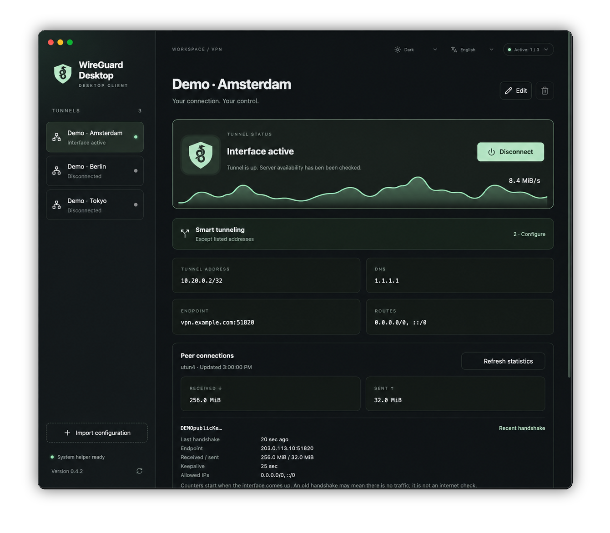

<p align="center">
  
</p>

<h1 align="center">WireGuard Desktop</h1>

<p align="center">
  A focused WireGuard client for macOS and Windows.<br>
  Multiple tunnels, selective routing, live traffic, and no cloud account.
</p>

<p align="center">
  <strong>English</strong>　·　<a href="README.ru.md">Русский</a>
</p>

<p align="center">
  <a href="https://github.com/Salvehn/wireguard-ui/releases/latest/download/WireGuard-Desktop-arm64.dmg"><strong>macOS</strong></a>
 　·　
  <a href="https://github.com/Salvehn/wireguard-ui/releases/latest/download/WireGuard-Desktop-x64-Setup.exe"><strong>Windows</strong></a>
 　·　
  <a href="https://github.com/Salvehn/wireguard-ui/releases/latest"><strong>Release notes</strong></a>
</p>

<p align="center">
  
  
  
  
</p>



<p align="center"><sub>Fictional profiles and traffic data. No real connection or private keys are shown.</sub></p>

## Highlights

- **Independent tunnels.** Import `.conf` profiles and connect several VPNs at once.
- **Smart tunneling.** Route selected addresses, domains, subdomains, or applications through each profile.
- **Live status.** See throughput, traffic counters, peer handshakes, and recent connection events.
- **Native desktop controls.** Use the main window or the macOS menu bar and Windows system tray.
- **Local by design.** Configurations and private keys stay on your computer.
- **Safe updates.** Install cryptographically verified updates from inside the app.
- **Comfortable UI.** English and Russian, with light, dark, and system themes.

## Smart tunneling

Open **Smart tunneling** on a disconnected profile and choose what should use that connection. Rules belong to the profile and only narrow its original `AllowedIPs`.

| Mode                         | Traffic through the connection                                         |
| ---------------------------- | ---------------------------------------------------------------------- |
| Configuration routes         | Routes from the imported `.conf`                                       |
| Only listed addresses        | Selected domains, IP addresses, and CIDR networks                      |
| Except listed addresses      | Original routes, excluding selected addresses                          |
| Only selected applications   | Processes inside selected macOS `.app` bundles or Windows `.exe` files |
| Except selected applications | Every other process                                                    |

<details>
<summary><strong>Domains, wildcards, and DNS</strong></summary>

- `example.com` matches the domain itself. `*.example.com` matches subdomains at any depth, but not the domain itself. Add both to cover the complete domain.
- Wildcards learn IPv4 and IPv6 addresses from system DNS until the profile disconnects. Sites sharing an IP follow the same rule, while applications using their own DNS-over-HTTPS can bypass it.
- In **Configuration routes** mode, profile DNS temporarily becomes system DNS. Selective modes keep the existing system DNS.
- Wildcards use `/etc/resolver` on macOS and NRPT rules on Windows. Changes are journaled and removed on disconnection or recovery.

</details>

<details>
<summary><strong>Applications and multiple VPNs</strong></summary>

- Address and application rules are alternative modes within one profile. Different profiles may use different modes at the same time.
- Specific work subnets keep priority. If application rules overlap, the most recently connected profile wins.
- Excluded or unmatched traffic may use another active VPN. Disconnecting one profile leaves the others running.
- Restart selected applications after connecting. Shared system services may not be recognized as part of an app, and WireGuard peer statistics are unavailable in application mode.

</details>

> [!NOTE]
> Wildcard and application routing are experimental. Changing active application routes can briefly interrupt their traffic.

## Install

| Platform | Supported system | Download                                                                                                      |
| -------- | ---------------- | ------------------------------------------------------------------------------------------------------------- |
| macOS    | Apple Silicon    | [DMG](https://github.com/Salvehn/wireguard-ui/releases/latest/download/WireGuard-Desktop-arm64.dmg)           |
| Windows  | x64              | [Installer](https://github.com/Salvehn/wireguard-ui/releases/latest/download/WireGuard-Desktop-x64-Setup.exe) |

Import a standard WireGuard `.conf` file after installation. Setting up or upgrading the system helper requires administrator approval. The Windows build is standalone: its verified WireGuard runtime is bundled inside WireGuard Desktop, with no separate client installation.

## Development

Requires Node.js 24 and npm.

```sh
npm ci
npm run dev
```

Run the checks used on `main`:

```sh
npm test
npm run test:release
npm run build
```

See [ARCHITECTURE.md](ARCHITECTURE.md) for the process and privilege boundaries. Release maintainers can find the build and publishing workflow in [docs/releases.md](docs/releases.md).
