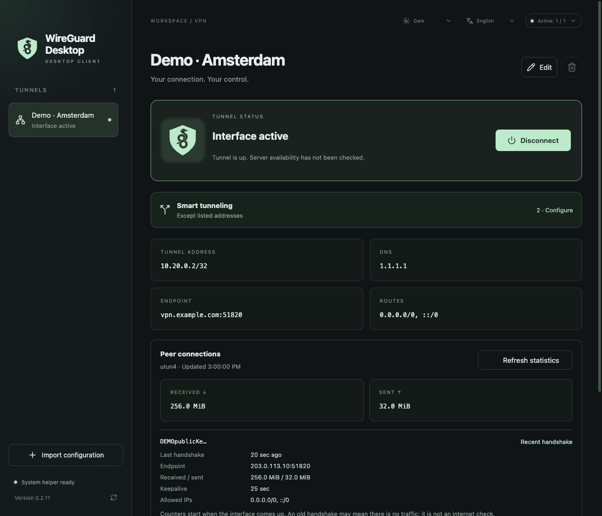

# WireGuard Desktop

**Русский** · [English](README.md) · [Скачать для Mac](https://github.com/Salvehn/wireguard-ui/releases/latest/download/WireGuard-Desktop-arm64.dmg)

Клиент WireGuard для macOS на Apple Silicon. Импортируйте профили `.conf`, подключайте несколько туннелей независимо и следите за трафиком и handshake. Управление доступно в окне и строке меню; конфигурации и ключи остаются на вашем Mac.

**Smart tunneling** настраивается для каждого соединения: исходные маршруты, только домены/IP-сети из списка или маршруты за исключением списка. Правила сужают исходные `AllowedIPs`; домены разрешаются при подключении. В режимах со списком используется системный DNS. Маршрутизация по приложениям не поддерживается.

Есть русский и английский языки, светлая и тёмная темы, обновления через интерфейс с прогрессом загрузки и перезапуском.

*На скриншоте демонстрационные данные, без реальных VPN-соединений и приватных ключей.*
